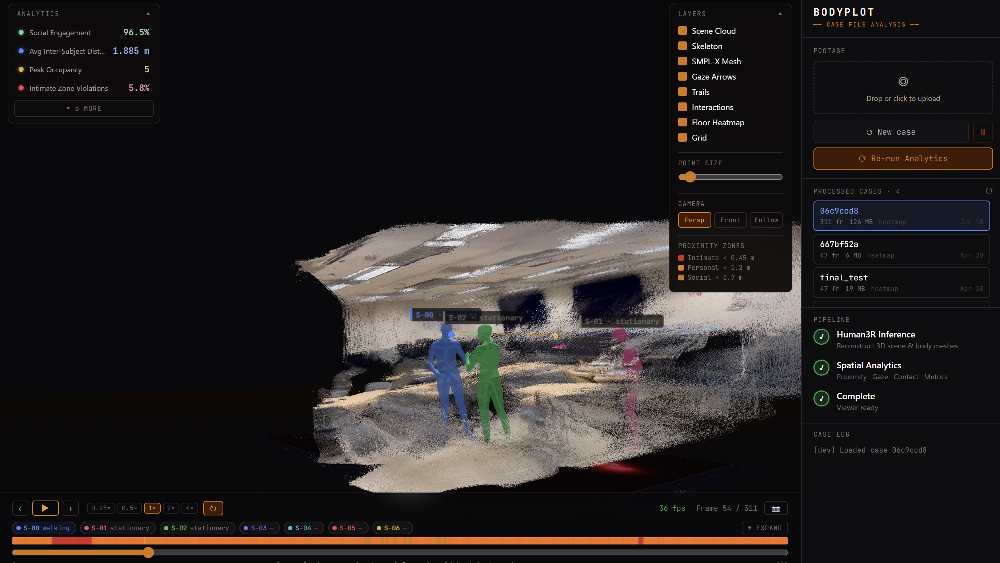
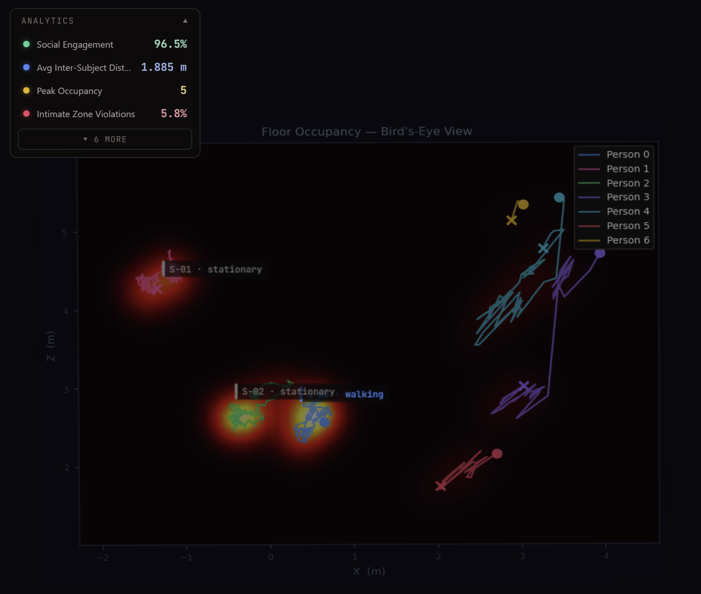
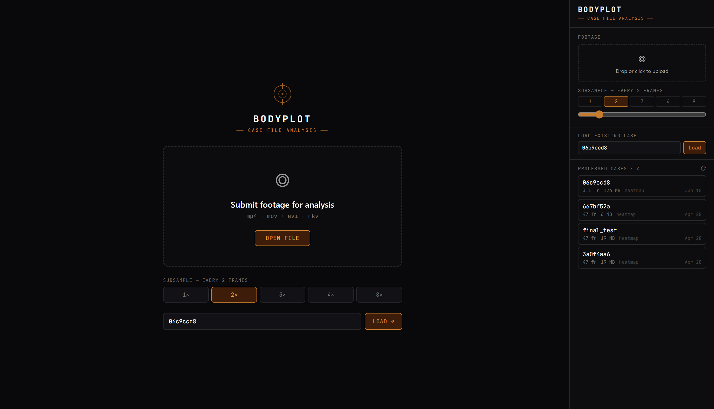

# BodyPlot

**Turn one ordinary video into a navigable 3D record of people, space, and how they interact.**

Point a single camera at a room — a phone clip, a CCTV feed, a handheld pan — and BodyPlot rebuilds the whole scene in 3D: every person as a full body mesh, the room itself as a dense point cloud, and the camera's path through it. Then it reads the social layer on top: who moved toward whom, who faced whom, who stood close enough to be in conversation, where people clustered, and where they never set foot.

No depth sensor. No motion-capture suit. No multi-camera rig. One RGB video in, a 3D dashboard out.

https://github.com/YuvrajPuyam/human3r-sitl/raw/master/docs/media/hero.mp4

<sub>▶ If the player doesn't load inline, [watch the walkthrough here](docs/media/hero.mp4).</sub>

---

## The idea

Hours of footage of people — security cameras, retail floors, lobbies, events — is almost entirely unsearchable. You can watch it, but you can't *ask* it anything. Where did the crowd bottleneck? Did those two people actually meet, or just pass by? How long did anyone spend in that corner?

BodyPlot turns that flat, passive video into queryable spatial and social data. It lifts people and their surroundings off the screen and into a shared 3D world, then measures the things humans intuitively read from a room — distance, orientation, approach, grouping — and makes them visible and quantified.

The framing is deliberately forensic: *who was where, near whom, facing whom, and when.*

---

## See it in action

Each capability below renders live in the browser dashboard.

### Reconstruction

Full SMPL-X body meshes for everyone in frame, a colored point cloud of the actual room, and the recovered camera trajectory — all in one shared coordinate system, from a single forward pass.



### Action recognition

Every person gets a per-frame action label — standing, walking, running, sitting, reaching, bending — shown as a floating badge that tracks them through the scene.

<sub>Visible as the floating labels tracking each person in the [dashboard capture above](docs/media/dashboard.png) and the [walkthrough video](docs/media/hero.mp4).</sub>

### Interaction analytics

Proximity, gaze, and contact, computed per pair every frame and grounded in proxemics research. Color-coded links connect people by how close and how engaged they are; a marker fires when two people's gaze actually meets.

<sub>The color-coded proximity links between people are visible in the [dashboard capture above](docs/media/dashboard.png) and the [walkthrough video](docs/media/hero.mp4).</sub>

### Groups and dyads

BodyPlot detects conversational groups (F-formations — people close *and* turned toward each other) as they form and dissolve, and produces a per-pair "relationship" report: time spent together, closest approach, share of mutual gaze, number of approaches.

<sub>Group clustering and per-pair reports surface in the analytics panel of the [walkthrough video](docs/media/hero.mp4).</sub>

### Floor heatmap

A bird's-eye density map of where people actually spent their time, with each person's path traced on top.



### The dashboard

Scrub the timeline, toggle layers, follow a subject, jump straight to detected events (meetings, group formations, the single closest contact). Everything runs in the browser with no install.



---

## How it works

Three stages, fully automated from upload to dashboard:

```
  one video
      │
      ▼
  Human3R          one forward pass →  body meshes · room point cloud · camera path
      │
      ▼
  analytics        proxemics · gaze · contact · actions · groups · events · heatmap
      │
      ▼
  3D dashboard     point cloud + meshes + overlays + timelines, in the browser
```

The reconstruction backbone is **[Human3R](https://arxiv.org/abs/2510.06219)** (ICLR 2026), which recovers multiple people and the surrounding scene together in one pass. BodyPlot wraps it in a headless runner, layers the social-interaction analytics on top, and ships a zero-build React + Three.js viewer to explore the result.

---

## Engineering highlights

A few problems worth calling out — the kind of thing that doesn't show up in a feature list:

- **Beating the browser's memory ceiling.** A full-resolution clip's vertex data is hundreds of megabytes — past Chrome's ~512 MB limit on a single JavaScript string, so the JSON simply refuses to parse. BodyPlot streams vertices as a compact Float32 binary loaded via `arrayBuffer()` instead, roughly 5× smaller and parse-free.
- **Physically meaningful metrics.** Movement speed and the walk/run thresholds are normalized to true meters-per-second using the clip's effective frame rate, so the numbers stay correct no matter how aggressively frames are subsampled.
- **Repairing broken identities.** Monocular tracking drops and reassigns person IDs across occlusions; a stitching pass reconnects fragments by motion continuity before any per-person metric is computed, so trajectories and action histories don't silently fall apart.
- **Memory-disciplined inference.** The runner frees GPU tensors in explicit stages so long videos don't get OOM-killed during post-processing.
- **No build step.** The entire frontend is React and Three.js over CDN with in-browser transpile — edit a file, refresh, done. No bundler, no `node_modules`.

---

## The numbers it reports

Summary metrics, each grounded in published work on how people use space:

| Metric | Reads as | Basis |
|--------|----------|-------|
| Social Engagement | how much of the clip had people in conversational range | Hall (1966) |
| Avg Inter-Person Distance | overall spacing between people | — |
| Intimate-Zone Time | moments of very close contact or crowding | Hall (1966) |
| Gaze Convergence | when lines of sight actually meet | Argyle & Cook (1976) |
| Approach Events | deliberate moves toward another person | Goffman (1971) |
| Group Formations | conversational clusters forming | Kendon (1990) |
| Movement Speed / Peak Occupancy | pace and crowding | — |

Plus per-pair dyad reports, per-person trajectory stats (path length, time moving, area covered), and an auto-detected event list.

---

## Run it

```bash
git clone --recurse-submodules https://github.com/YuvrajPuyam/human3r-sitl.git
cd human3r-sitl

conda create -n human3r128 python=3.11 cmake
conda activate human3r128
conda install pytorch torchvision pytorch-cuda=12.4 -c pytorch -c nvidia
pip install -r requirements.txt
pip install fastapi uvicorn sse-starlette scipy

# CUDA RoPE kernels (required)
cd src/croco/models/curope && python setup.py build_ext --inplace && cd -

# Model weights
bash scripts/fetch_smplx.sh
huggingface-cli download faneggg/human3r human3r_896L.pth --local-dir ./src
```

Then launch the dashboard:

```bash
cd sitl
uvicorn backend.main:app --reload --port 8000
# open http://localhost:8000/app, drop in a video, pick a subsample rate, run
```

Want to explore a result without a GPU? Enter a previously computed job ID in the
sidebar and it loads in about a second.

**Needs:** Linux + CUDA (about 12 GB VRAM for the default model; lighter checkpoints
exist). Action recognition optionally uses a MotionBERT checkpoint and falls back to
biomechanical heuristics without one. Full setup, model options, output schemas,
and architecture notes live in [`CLAUDE.md`](CLAUDE.md).

---

## Built on

- **Human3R** — *Generalizable 3D Human Reconstruction in the Wild*, Fan et al. (ICLR 2026)
- **DUSt3R** — Dense Unconstrained Stereo 3D Reconstruction, Wang et al.
- **Multi-HMR** — Multi-person Human Mesh Recovery from a Single Image, Baradel et al.
- **SMPL-X** — Pavlakos et al. (2019)
- **MotionBERT** — Zhu et al. (2023)

Interaction metrics draw on Hall (1966), Argyle & Cook (1976), Goffman (1971), and Kendon (1967, 1990).

---

## License

BodyPlot application code (`sitl/`, `engine.py`) is MIT. The Human3R model code in `src/`
remains under its [original license](https://github.com/fanegg/Human3R).
